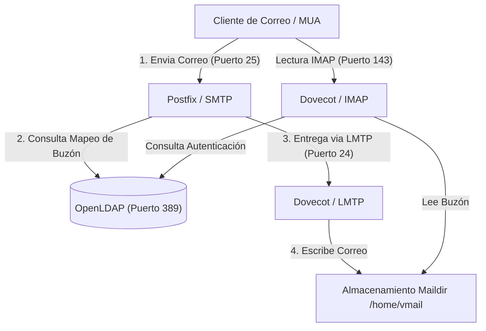

# Servidor de Correo Integrado (SMTP + IMAP + OpenLDAP)

Este proyecto implementa una infraestructura completa de correo electrónico contenerizada utilizando **Postfix** (SMTP), **Dovecot** (IMAP/LMTP) y **OpenLDAP** (Servicio de Directorio). Está diseñado para resolver la autenticación centralizada de usuarios de correo y la entrega dinámica de buzones virtuales de forma eficiente y persistente.

---

## 📌 Arquitectura del Sistema

El siguiente diagrama muestra el flujo de comunicación entre el cliente de correo (MUA), los servidores de correo y la base de datos de usuarios LDAP:



---

## 🛠️ Detalle Técnico de los Componentes

### 1. Directorio Activo (OpenLDAP) — `./ldap`

- **Imagen base:** `debian:12-slim` con `slapd` y `ldap-utils`.
- **Inyección de Esquemas:** Al iniciar por primera vez, el script `entrypoint.sh` convierte e instala dinámicamente los esquemas `misc.schema` y `courier.schema` (necesario para la clase de objeto `CourierMailAccount`).
- **Persistencia:** Almacena los datos y la configuración en directorios mapeados en el host (`./ldap/data` y `./ldap/config`). Evita reinicializaciones destructivas si detecta la base de datos existente.
- **Dominio por Defecto:** `frijoli.com` con contraseña de administrador `admin123`.

### 2. Agente de Transferencia de Correo (Postfix SMTP) — `./smtp`

- **Imagen base:** `debian:12-slim` con `postfix` y `postfix-ldap`.
- **Dominios Virtuales:** Configurados dinámicamente en `/etc/postfix/vdomains.txt` (`frijoli.com`, `diana.frijoli.com`).
- **Consultas LDAP:** Emplea `ldapmaps.cf` para resolver qué buzón (`mailbox`) pertenece a cada dirección de correo (`mail`).
- **Bypass de Chroot (Crucial):** Todos los demonios en `master.cf` están configurados con `chroot = n`. Esto previene fallos de comunicación con el DNS y LDAP causados por el aislamiento típico de Postfix.
- **Entrega LMTP:** El parámetro `virtual_transport = lmtp:inet:imap:24` redirige la entrega final al puerto 24 del contenedor `imap` usando el protocolo LMTP.

### 3. Agente de Entrega e IMAP (Dovecot) — `./imap`

- **Imagen base:** `debian:12-slim` con `dovecot-core`, `dovecot-imapd`, `dovecot-lmtpd` y `dovecot-ldap`.
- **Seguridad de Archivos:** Crea el usuario/grupo virtual `vmail` con UID/GID `1005`.
- **Autenticación (Passdb/Userdb):** Configurado a través de `dovecot-ldap.conf.ext`. Utiliza filtros flexibles para permitir el acceso tanto con el correo electrónico completo (`mail`) como con el nombre de usuario (`uid`):
  - `pass_filter` / `user_filter`: `(&(objectClass=CourierMailAccount)(|(mail=%{user})(uid=%{user})))`
- **Buzón Dinámico:** Mapea el atributo `mailbox` de LDAP al directorio del buzón final del usuario mediante la plantilla:
  `user_attrs = homeDirectory=home, uidNumber=uid, gidNumber=gid, mailbox=mail=maildir:/home/vmail/%$`
- **LMTP Server:** Escucha en el puerto `24` dentro del contenedor para recibir correos desde Postfix.

---

## 🚀 Guía de Despliegue y Uso

### Paso 1: Preparar permisos en el Host

Dado que los contenedores utilizan el UID/GID `1005` para escribir en el correo virtual compartiendo el volumen `/home/vmail`, debes asegurarte de que dicho directorio exista en el host y tenga los permisos correspondientes:

```bash
sudo mkdir -p /home/vmail
sudo chown -R 1005:1005 /home/vmail
sudo chmod -R 770 /home/vmail
```

### Paso 2: Construir las Imágenes Locales

Si las imágenes del registro de Docker (`lcarles2d/*`) no están disponibles o deseas probar cambios locales, puedes construirlas tú mismo ejecutando:

```bash
docker build -t lcarles2d/openldap:pdc ./ldap
docker build -t lcarles2d/postfix:pdc ./smtp
docker build -t lcarles2d/dovecot:pdc ./imap
```

### Paso 3: Levantar el Stack de Servicios

Utiliza Docker Compose para iniciar la infraestructura en segundo plano:

```bash
docker-compose up -d
```

Verifica que todos los contenedores estén corriendo de forma estable:

```bash
docker-compose ps
```

---

## 👥 Gestión de Usuarios en LDAP

Para que los servidores SMTP e IMAP reconozcan a los usuarios, estos deben estar registrados en el OpenLDAP bajo la unidad organizativa `ou=usuarios,dc=frijoli,dc=com` y poseer los atributos de `CourierMailAccount`.

### Ejemplo de Archivo LDIF (`usuario.ldif`):

Crea un archivo temporal con la estructura del usuario:

```ldif
dn: uid=luis,ou=usuarios,dc=frijoli,dc=com
objectClass: inetOrgPerson
objectClass: posixAccount
objectClass: CourierMailAccount
cn: Luis Frijoli
sn: Frijoli
uid: luis
uidNumber: 1005
gidNumber: 1005
homeDirectory: /home/vmail
mail: luis@frijoli.com
mailbox: frijoli.com/luis
userPassword: admin123
```

> [!NOTE]
>
> - El atributo `mail` (`luis@frijoli.com`) es utilizado por Postfix para verificar la validez del destinatario.
> - El atributo `mailbox` (`frijoli.com/luis`) determina la subcarpeta en `/home/vmail/` donde se guardará el correo.

### Cargar el usuario en LDAP:

Ejecuta la importación desde tu terminal host (apuntando al puerto `389` expuesto):

```bash
ldapadd -x -H ldap://localhost:389 -D "cn=admin,dc=frijoli,dc=com" -w admin123 -f usuario.ldif
```

---

## 🧪 Pruebas de Funcionamiento

### 1. Probar entrega SMTP (Puerto 25)

Puedes simular el envío de un correo de prueba conectándote por `nc` o `telnet` al contenedor SMTP:

```bash
nc localhost 25
```

_(Envía los siguientes comandos SMTP línea por línea)_

```smtp
EHLO localhost
MAIL FROM: <remitente@externo.com>
RCPT TO: <luis@frijoli.com>
DATA
Subject: Correo de prueba PDC

Hola Luis, esta es una prueba de integracion SMTP -> LMTP -> Maildir.
.
QUIT
```

### 2. Verificar la entrega en disco

Si la entrega fue exitosa, el correo debe haberse guardado bajo la ruta compartida en la estructura Maildir:

```bash
sudo ls -R /home/vmail/frijoli.com/luis/new/
```

### 3. Probar Acceso IMAP (Puerto 143)

Verifica que el usuario se puede autenticar e inspeccionar su buzón conectándote a Dovecot:

```bash
nc localhost 143
```

_(Ingresa los comandos IMAP)_

```imap
. LOGIN luis admin123
. SELECT INBOX
. FETCH 1 BODY[TEXT]
. LOGOUT
```

---

## 📂 Estructura de Archivos del Proyecto

```text
├── docker-compose.yaml        # Orquestación de contenedores y mapeo de puertos/volúmenes.
├── ldap/
│   ├── Dockerfile             # Construcción del servidor OpenLDAP con courier.schema.
│   └── entrypoint.sh          # Inyector dinámico de esquemas slapd y arranque.
├── smtp/
│   ├── Dockerfile             # Construcción de Postfix con postfix-ldap.
│   ├── main.cf                # Configuración principal (LMTP virtual_transport).
│   ├── master.cf              # Definición de procesos y bypass de chroots.
│   ├── ldapmaps.cf            # Mapeo de buzón virtual usando LDAP.
│   └── vdomains.txt           # Dominios virtuales autorizados.
└── imap/
    ├── Dockerfile             # Construcción de Dovecot (IMAP + LMTP).
    ├── dovecot.conf           # Punto de entrada de configuración.
    ├── dovecot-ldap.conf.ext  # Filtros de búsqueda y mapeo de atributos LDAP.
    └── conf.d/                # Configuraciones modulares de Dovecot:
        ├── 10-auth.conf       # Habilitación de métodos de autenticación.
        ├── auth-ldap.conf.ext # Declaración de bases de datos passdb/userdb.
        ├── 10-logging.conf    # Configuración de logs.
        ├── 10-mail.conf       # Configuración de buzones y permisos vmail (1005).
        └── 10-master.conf     # Listeners de red (IMAP puerto 143, LMTP puerto 24).
```
